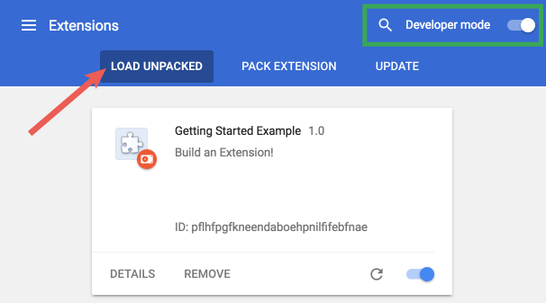

__HELLO CHROME EXTENSION__
==========================

Extensions are made of different, but cohesive, components. Components can include background scripts, content scripts, an options page, UI elements and various logic files. Extension components are created with web development technologies: HTML, CSS, and JavaScript. An extension's components will depend on its functionality and may not require every option.

This tutorial will build an extension that allows the user to change the background color of any page on developer.chrome.com. It will use many core components to give an introductory demonstration of their relationships.

To start, create a new directory to hold the extension's files.

The completed extension can be downloaded here.

1. CREATE THE MANIFEST

Extensions start with their manifest. Create a file called manifest.json and include the following code, or download the file here.

manifest.json

```
{
    "name": "Getting Started Example",
    "version": "1.0",
    "description": "Build an Extension!",
    "manifest_version": 2
}
```

The directory holding the manifest file can be added as an extension in developer mode in its current state.

1. Open the Extension Management page by navigating to chrome://extensions.

   The Extension Management page can also be opened by clicking on the Chrome menu, hovering over More Tools then selecting Extensions.

2. Enable Developer Mode by clicking the toggle switch next to Developer mode.
3. Click the LOAD UNPACKED button and select the extension directory.



Ta-da! The extension has been successfully installed. Because no icons were included in the manifest, a generic toolbar icon will be created for the extension. 

## ADD INSTRUCTION

 Although the extension has been installed, it has no instruction. Introduce a background script by creating a file titled background.js, or downloading it here, and placing it inside the extension directory.

Background scripts, and many other important components, must be registered in the manifest. Registering a background script in the manifest tells the extension which file to reference, and how that file should behave. 

## GIVE USERS OPTIONS

The extension currently only allows users to change the background to green. Including an options page gives users more control over the extension's functionality, further customizing their browsing experience.

Start by creating a file in the directory called options.html and include the following code, or download it here.

Four color options are provided then generated as buttons on the options page with onclick event listeners. When the user clicks a button, it updates the color value in the extension's global storage. Since all of the extension's files pull the color information from global storage no other values need to be updated.