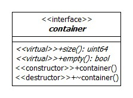
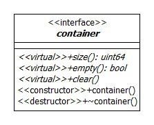

THE BEGINNING
=============

게임엔진이라는 거창한 타이틀을 가지고 작업하려는 것은 아니었는데, 딱히 쓸만한 말이 없어서 게임엔진이란 타이틀을 붙여 봅니다.
컴퓨터 그래픽스 관련된 개발을 한동안 손놓고 있었는데 잠시 여유가 생겨서 간단한 수학 공식을 그래프로 표현하려 했는데 무엇을 어떻게 해야 하는지 막혔습니다. "그래프로 표현하기 위해서 X, Y축을 그려야 하는데, 어디에 어떻게 그리지?" 윈도우에 그릴까? 아니면 웹에 그릴까? 많은 고민만 하고 하루 이틀을 보내다가 "아예 하나 만들어 보자."라고 계획을 잡았습니다. 배보다 배꼽이 더 큰 프로젝트가 되어 버린 것이죠.
어짜피 커지는 프로젝트라면 이전에 해보고 싶었던 프로젝트들을 하나씩 여기에 포함시켜보자 생각을 했습니다.

그래서 "CUSTOMIZE HOMEWORLD2 FROM SCRATCH"란 프로젝트를 첫번째 프로젝트로 진행해보려 합니다.
"CUSTOMIZE HOMEWORLD2 FROM SCRATCH"란 홈월드2를 즐기면서 이런 부분을 이렇게 고치면 어떨까? 저런 부분은 저렇게 고치면 어떨까? 고민하던 것을 직접 만들어 가면서 고쳐가려는 것입니다. 그러면서 하나의 쓸만한 컴퓨터 그래픽스 관련한 라이브러리도 만들어 가려는 것 입니다.

게임을 만들기 위해서 처음 무엇을 어떻게 해야할까요?

저는 우분투에서 작업하기를 좋아합니다.
그렇기 때문에 개발 컴퓨터의 운영체제를 우분투를 사용하려 합니다.
우분투 18.04.4 데스크탑 버전을 받고 있는 중입니다.

컴퓨터에 설치하고 개발환경을 구축해야겠지요.

그전에 저는 이 프로젝트가 우분투와 웹환경에서 동작하도록 만들려고 합니다.
우선 우분투 어플리케이션 프로그램은 C++ 을 이용해서 작성할 것이고, 웹은 자바스크립트를 이용해서 개발하려 합니다.
그러니까 프로그래밍 언어를 C++/JAVASCRIPT 를 선택할 것이고, 그러기 위해서 C++ 컴파일 프로그램은 GCC 와 노드를 기본적으로 설치할 것입니다.
그리고 코드를 작성해야 하는데, 텍스트 에디터를 저는 ATOM 을 이용하려 합니다.
저의 개발 환경은 처음 VISUAL STUDIO 에서 이클립스, CLION, 그리고 ATOM 에 이르렀네요.
CLION 은 지금도 구입해서 사용할까 고민하고 있는데,
딱히 지금에 익숙해져서 ATOM 에서 벗어나지 않을 것 같습니다.
그리고 작성한 코드를 관리하기 위한 리포지터리로 GIT 을 이용하고 있습니다.
그러면 컴퓨터에는 GIT 이 설치되어 있어야 하겠죠.

그러면 저한테 필요한 것을 정리해보면

__개발을 위한 운영체제__

- UBUNTU 18.04.4 DESKTOP

__개발을 위해 필요한 필수 패키지__

- GCC
- NODEJS
- ATOM
- GIT

게임엔진이 기본적으로 가지고 있어야 하는 것들은 무엇이 있을까요?

그래픽스 관련된 라이브러리, 물리 관련된 라이브러리, 네트워크 관련된 라이브러리, 스크립트 관련된 라이브러리 등이 있을 것 같습니다.
우선 저는 렌더링을 위해서 그래픽스 관련된 라이브러리를 만들 것입니다.
그리고 네트워크 관련된 라이브러리 역시 만들 것입니다.
그러면 움직이지 않고 충돌하지 않는 라이브러리가 완성이 되겠죠.
그리고 부가적으로 GUI 를 위한 라이브러리도 만들어 보려 합니다.
그러면 게임을 작성할 수 있는 소프트웨어가 나오지 않을까요?
CUI 로 작업을 진행했었는데, 타이핑이 많았다는 것이 불편하긴 했지만, 뭔가 GUI 와 다른 묘한 매력이 있네요.

이런 것들을 쉽게 구축하려면 몇 가지 선행적으로 만들어야 하는 것들이 있습니다.
바로 자료구조입니다.
저는 이것에 대한 이름은 "xCore" 라고 지었습니다.
"x" 란 이름으로 루트 이름 공간의 이름을 정했는데, 정하고 나니까 뭔가 멋있어 보이더라구요.
실상은 루트 이름 공간의 이름으로 마음에 드는 것이 없어서 자포자기 심정으로 "x"라고 한 것입니다.

"x::string" 이라고 하니 이전에 정해보려고 했던 다름 이름 공간의 이름보다 멋있고, 쓸만한 느낌을 주더라고요.
비밀스러운 프로젝트란 느낌도 주고요.

__개발하려고 하는 패키지__

- CORE
- GRAPHICS
- NETWORK
- PHYSICS
- SCRIPT
- GUI/CUI

자료구조 중에 가장 먼저 만들려고 하는 것은 ARRAY 입니다.
STANDARD TEMPLATE LIBRARY 사용하면 좋습니다.
제가 직접 여러 자료구조를 만들려고 하는데, 이것을 하려는 것은
STL 이 나쁘기 때문이 아닙니다. 정말 좋은 템플릿 라이브러리입니다.
다만, 개인적인 취향으로 이터레이터가 마음에 들지 않는 것이 있습니다.
그리고 상속하여 구현하기 어렵다는 점이 있습니다.
만들어진 것이기 때문에 커스터마이즈가 어렵다는 점도 있습니다.
정확히 그저 개인적인 취향이란 것이고, 그렇게해서 직접 만들어서 사용하고 나니
좋은 점은 필요한 것이 있으면 마음껏 직접 컨트롤할 수 있다는 점과
그래서 복잡한 코드가 내부 함수로 구현되면서 한줄로 변경된다는 점이 있지요.
마치 이것쯤은 만들어주면 코드가 간단해질텐데 이런 것들...
하지만, 직접 만든 것에 버그를 내면 그 다음부터 라이브러리가 산으로 갑니다.
버그가 어디서 나왔는지 디버깅을 해야 하지요.
STL 은 잘 만들었졌기 때문에 권장하는데로 사용하면 그곳에서 쓸모 없는 디버깅을 할 필요가 없습니다.
다른 것에 신경쓰지 말고 만들려고 하는 컨텐츠에 집중하라는 것이 얼마나 좋고 편리한지 모두들 아실 것 입니다.

그렇지만 저는 직접 만들어 보려고 한다는 것,

```
x::map<x::string, x::string> __map;
...
__map.each([](const x::string & key, x::string & value){ x::console::out << value << x::endl; });
```

"for_each" 대신에 멤버 함수로 each 를 구현해보았더니 편리하기도 합니다.
내부에서 접근리라서 iterator 객체를 만들어야 하는 오버헤드도 조금은 줄이지 않았나 생각이 됩니다.
그리고 네트워크를 통한 자료구조를 고민했던 시절이 있었는데, 함수를 통해서 접근하면 네트워크에서 외부에 있는 자료구조 데이터에 접근하여도 논리에 어긋남 없이 자료구조를 사용하는 것 처럼 사용할 수 있어 보입니다.
그것을 위한 포석인 것이죠.

차후에 그것에 대한 프로젝트를 진행보는 것도 나쁘지 않아 보입니다.

하지만 지금은 "CUSTOMIZE HOMEWORLD2 FROM SCRATCH" 에 집중하려 합니다.

많은 것들을 직접 만들어 보려는 것이 목적이지만 그것에 포커싱을 하여 하나씩 다 만들어 가기보다는 필요할 때 만드는 것을 계획하고 있습니다.
그렇기 때문에 POSIX 표준과 FREEGLUT 를 내부에서 사용하려 합니다.

라이브러리를 사용하고 배포하기 위해서는 포함관계를 잘 설정해야 합니다.

우선 자료구조 접근하려 합니다.

자료구조의 기반이 되는 클래스로 컨테이너 내부 아이템의 타입과 무관한 컨테이너가 가져야 하는 공통적인 메서드들을 정의하려는 container 란 클래스를 정의할 것 입니다. 그리고 타입과 관계있는 컨테이너가 가져야 하는 행동들을 정의할 클래스의 이름을 collection 이라고 정했습니다.

컨테이너의 클래스의 모습은 아래와 같습니다.



컨테이너가 가져야 하는 공통적인 메서드들은 여러가지가 있을 것 입니다.
다만, size, empty 란 메서드만 정의하여도 충분하더라구요. 버전 1.0.0 이 되면 뭔가 더 정의되어져 있겠지요.

이제 하나씩 코드를 정의하려고 하는데, 현재 지원하려는 언어가 C++, JAVASCRIPT 이기 때문에 두가지만 폴더 자료구조를

```
src - core
    - js
```

라고 정해봅니다.

C++ 의 장점이며 단점인 연산자 재정의 그리고 다양하게 지원하는 문법.

실수를 덜 하게 하려는 라이브러리를 만들려면 몇몇 작업을 해주어야 하는데,
그 중에 하나가 객체 생성을 위해서 정의해야 하는 메서드들 중에 사용하지 않기로 하겠다라고 명시를 해주어야 하는 부분이 있습니다.

저는 기반이 되는 클래스 그리고 추상 클래스에 대해서 protected 로 상속하지 않으면 접근을 못하게 한다거나 혹은 delete 를 명시하여 사용하지 않겠다라고 컴파일러에 이야기 해줍니다. 사실 C++ 이 이런 점이 마음에 들지 않으면서 마음에 듭니다. 뭐라고 이야기해야할까요? 강력하지만 코드 줄이 늘어난다. 이런 느낌입니다.

템플릿 라이브러리 혹은 클래스를 만들 때는 조심해야 합니다.
템플릿 라이브러리는 사용되어질 때 컴파일하는 경향이 있습니다. 스펙을 보고 이야기해야 하는데, 글쎄요 관습법이라고 할까요? 많은 컴파일러들이 템플릿에 타입을 명시해서 사용하려 할 때 그것을 만들기 때문에, 인라인 구현을 하지 않으면 이미 컴파일된 파일 때문에 더 이상 새로운 타입에 대한 컴파일을 진행하지 않아서 컴파일 에러를 출력하게 되죠. 저도 자바를 다루기 전까지 C++ 로 템플릿을 작성하지 않았습니다. 다만, 자바를 통해서 템플릿의 묘미를 알았다고 할까요? 이것이 문제죠. 알아간 후에 프로그램은 더 어려워집니다. 언제가 그런 이야기를 했던 적이 있습니다. C++ 은 적당히 몰라야 생산성이 좋은 언어라구요. 알아가면 알아갈 수록 해주어야 하는 부분이 많습니다.

아참 이것을 먼저 정의하기 전에 타입을 재정의해야 겠군요.
차후에 멀티플랫폼을 고민하고 있기도 해서 자주 사용하는 타입을 아래와 같이 정의하려 합니다.

| TYPE | DESCRIPTION |
| ---- | ----------- |
| x::int8 | 8 bit integer |
| x::int16 | 16 bit integer |
| x::int32 | 32 bit integer |
| x::int64 | 64 bit integer |
| x::uint8 | 8 bit unsigned integer |
| x::uint16 | 16 bit unsigned integer |
| x::uint32 | 32 bit unsigned integer |
| x::uint64 | 64 bit unsigned integer |
| x::float32 | 32 bit float |
| x::float64 | 64 bit float |
| x::real    | default float type |
| x::character | character type |
| x::byte      | byte type |
| x::boolean   | boolean type |

뭐랄까 개인적인 취향이라고 할까요? IDE 에서 기본 타입을 정의해서 사용하는 것이 왠지 라이브러리 같지 않다고 할까요? 하하하! 의미없어 보이지만 뭔가 표준화된 작업을 위한 것도 있고, 라이브러리 같아 보인다고 할까요? 사실 몇가지 엉뚱한 이유도 있기는 하지만 기본 타입을 재정의하는 것은 플랫폼마다 다른 타입의 크기 때문에 정상적으로 동작하지 않을 경우 일괄적으로 올바른 타입을 재정의하여 빠르게 잘못된 점을 변경할 수 있기 때문입니다. 더불어 코드에 개성을 더하는 것이기도 하구요.

아직은 컴파일 하지 않습니다.

이제 collection 이란 추상 클래스를 정의하려 합니다. 자료구조를 만들려는 의도를 앞서 이야기 드렸습니다.

- REMOTE DATA STRUCTURE SERVER 를 만들어 보려는 것
- 직접 필요한 메서들을 쉽게 추가하는 것과 같이 커스터마이즈를 쉽게 하려는 것
- 성능 향상에 빠졌을 때, 충분히 성능 향상 작업을 진행하려는 것

그리고 논 오피셜로 개성을 가져보려고 하는 것.

기반 클래스를 정의하였습니다. container 란 기반 클래스는 타입과 무관한 기반 추상 클래스이고, collection 역시 기반 클래스지만 타입과 관계된 공통의 행동을 정의하려는 것입니다.

collection 클래스 역시 추상 클래스이다 보니 사용하지 않는 delete 키워드로 중요한 메서드들을 정의해주어야 합니다.

같은 이름의 다양한 순수할수를 같은 곳에 정의하려고 했는데, 이번에는 조금 달리 접근하기 위해서 아래처럼 다시 정의해봅니다. container 클래스가 clear를 가지고 있는 것이지요.



어떻게든 STL 에 대한 의존성을 없애보고 싶지만 역시 function 과 initializer list 는 좋은 방법이 없네요.

그래서 아래처럼 재정의하였습니다.

```
template <typename T> using function = std::function<T>;
template <typename T> using initializer = std::initializer_list<T>;

template <typename T> struct __reference_remove_tag { typedef T type; };
template <typename T> struct __reference_remove_tag<T &> { typedef T type; };
template <typename T> struct __reference_remove_tag<T &&> { typedef T type; };

template <typename T> constexpr typename __reference_remove_tag<T>::type && move(T && o) noexcept
{
    return static_cast<typename __reference_remove_tag<T>::type &&>(o);
}
```

아마도 몇몇 함수들은 이렇게 사용되어질 것 입니다.
다만, 바꿀 수 있고 구현할 수 있다면 직접 구현하기도 하겠지요.

이전에는 add 그리고 del 이란 메서드들을 정의하였는데, 지금은 그렇지 않을 생각입니다. 필요할 때 구현하려구요.

이제 첫번째 자료구조인 array 를 정의할 차례입니다.

배열을 정의해서 사용하려는 것은 CAPACITY 때문입니다.

배열 클래스는 인덱스를 통한 접근이 가장 빠른 자료구조입니다.
그렇지만 자료의 삽입과 삭제 시에 배열의 인덱스를 관리하기 위해서 저장 공간 전체를 다시 만들고 COPY 를 해주어야 하는 문제가 있습니다. 너무 좋은 자료구조이며, 어쩌면 MAP 과 SET, LINKED 리스트에 비해서 정말 좋은 자료구조인데, 그 OVERHEAD 를 줄일 수 있다고 하면 굳이 MAP, LINKED LIST 같은 자료구조를 사용해야 할 이유가 있을까요?
그래서 생각해 낸 것이 CAPACITY 로 적정 크기의 새로운 데이터가 삽입되더라도 메모리를 재할당하지 말자. 그리고 그 크기가 넘어갈 때만 재 설정을 하도록 하자. 뭐 이런 개념을 도입하고 싶었던 것입니다.
그래서 PAGE & CAPACITY 란 개념을 두어 보려고 합니다.

그러면 하나의 데이터를 입력할 때마다 메모리 공간을 재할당해야 하는 문제가 최소화될 것이니까요! array 에 기본이 되는 메서드들은 무엇이 있을까요?

push, pop, 저는 이런 이름 대신에 assign, append 란 이름을 사용할까 합니다. STL 과 유사함도 같추고 싶거든요. 그것말고 다른 메서들이 있을까요? 아하 자료에 접근할 수 있는 통로를 만들어주어야 겠군요.

C++ 의 장점이자 단점 연산자를 재정의할 있습니다.

----

OS 설치 후에 해야 할 일

```
sudo apt update
sudo apt upgrade
sudo apt install git
sudo apt install build-essential
wget https://nodejs.org/dist/v12.16.1/node-v12.16.1-linux-x64.tar.xz
tar xvf node-v12.16.1-linux-x64.tar.xz
sudo mkdir /opt/nodejs
sudo mv node-v12.16.1-linux-x64 /opt/nodejs/
sudo chown sean:sean /opt/nodejs -R
sudo apt install vim
vi ~/.bashrc
```

~/.bashrc 하단에 환경 변수 설정

```

export NODE_HOME=/opt/nodejs/node-v12.16.1-linux-x64
export PATH=$NODE_HOME/bin:$PATH
```

```
source ~/.bashrc
git --version
gcc --version
node --version
```

아참 메모리 릭체크 중요하죠!

```
sudo apt install valgrind
valgrind --version
```

이제 아톰까지 다 설치되었습니다. VISUAL STUDIO CODE 가 좋다고 하는데 한번 사용해 보려고 하고 있는데,
익숙한 ATOM 으로 현재 작업을 진행해 보려 합니다.

----

배열을 정의할 차례입니다.

주석에 대해서 고민을 많이 해보았는데, 나중에 코드를 정리할 시점들에서 하나씩 하나씩 주석을 채워 나가려구요.
현재는 고민하지 않습니다. 주석 중요합니다. 영문으로 주석을 작성하고 마크 다운 작성 시에 테이블만은 영문으로 작성하는데
이것 역시 개성이지요. 하하하!

배열의 내부 멤버로

container, size, capacity, page 란 멤버를 정의합니다.
컨테이너는 실제 데이터가 연속적으로 저장되어 있는 메모리 공간이고, size 는 실제 크기이며 즉 데이터의 총 갯수, 그리고 capacity 는 메모리 공간의 크기입니다. 그리고 page 는 메모리 공간의 증가가 필요할 때, 증가하는 크기의 유닛 단위입니다.

page 와 데이터의 갯수를 통해서 page 크기를 구하는 함수를 만들어 두면 실수를 줄일 수 있지요.
저장 용량을 계산하는 것은 여러번 호출됩니다. 그래서 미리 만들어 두도록 하겠습니다.

```
x::page::calculate(...);
```

이라고 정의하면 잘 사용할 수 있어 보이네요.
지금보니 calculate 란 이름이 길어 보입니다.
저는 뭔가 이름을 정의할 때 full 로 다 써주는 것을 좋아합니다.
약자로 쓰는 순간, 짧아서 좋기는 한데, 같은 약자의 다른 의미가 있을 때, 어떻게 해야 할지 고민이 많거든요.
그래서 길어 보이기는 하지만 사용하도록 하겠습니다.

paging 이란 클래스를 정의할 것인데, core 에 넣어두려구요.
자주 사용하는 것이기에 이렇게 사용하려 합니다.

나눗셈의 연산에서는 나누고자 하는 값이 0이면 컴퓨터는 예외를 출력합니다. 그렇기 때문에 저는 디폴트 크기를 정의해 놓고 0으로 나누려고 하면 그 값을 디폴트 값으로 변경하는 로직을 추가하였습니다.

이것을 정의하기 전에 메모리 할당과 해제에 대해서 미리 구현할 필요가 있어 보입니다.
미리 정의해두면 배열을 구현할 때 쉽게 사용되어 질 것 입니다.

메모리란 클래스도 core 에 넣어 두도록 하겠습니다.

메모리를 클래스로 정할까 이름 공간에 몰아 둘까 고민을 많이 했습니다.
클래스보다는 이름공간이 좋아 보여서 그리고 명시적으로 특수화해야 하는데 그럴때 클래스로 정의하면 프로그래밍에 어려움이 존재하더라구요.
그래서 이름 공간으로 정의하려 합니다.

아래와 같이 메모리를 할당하는 코드를 작성하였습니다.

```
template <typename T>
T * allocate(x::uint64 n)
{
    if(n > 0)
    {
        return reinterpret_cast<T *>(__core_malloc(sizeof(T) * n));
    }
    return nullptr;
}
```

위의 코드에서 문제가 생기는 부분은 어디일까요?

바로

```
void * p = x::memory::allocate<void>(16);
```

을 하면 컴파일러는 정상적으로 동작하지 않습니다.
그래서 저는 void 타입에 대해서 명시적으로 sizeof 연산을 제거하는 함수를 정의할 것입니다.

메모리 할당을 정의했으니 이제 메모리 해제 함수를 만들어야겠군요.

FREE 란 이름을 deallocate 로 정의하였습니다. 그리고 이전에 FREE 와 달리 RETURN 값을 달았는데
다른 이유는 없고,

```
__memory = x::memory::deallocate<T>(__memory);
```

와 같은 코드를 작성해서

```
::free(__memory);
__memory = nullptr;
```

이란 코드를 한줄로 줄여 보기 위한 생각입니다.
FREE 는 명시적 특수화를 해야할 이유가 없어 보이네요.

이제 간단한 예제를 만들어 보려 합니다.

cmake 도 설치해야 하는군요.

추가적으로 명시합니다.

```
sudo apt install cmake
cmake --version
```

예제 프로젝트의 이름을 정하고 프로젝트 이름도 달아야 겠네요.

그저 간단하게 example 로!

```
mkdir build
cd build
cmake -DCMAKE_BUILD_TYPE=Debug -G "Unix Makefiles" ..
cmake --build .
```

간단한 예제를 만들기 전에 UNIT 테스트도 대신 할겸 exception 클래스를 다루어 보기로 하였습니다.
exception 도 core 로!
exception 은 stl 에서 상속받도록 하겠습니다.
되도록 이면 사용을 없애고 싶은데, 아직은 때가 아닙니다.
저는 "\_" 나 대문자 컨벤션들 좋아하지 않습니다.
함수 이름이 단문이었으면 하지요.
그래서 exception 을 던지는 매크로를 정의하려 하는데 많은 고민을 하였습니다.
고육지책으로 내 놓은 이름이 exceptional 나름은 쓸만하더라구요.

```
valgrind --leak-check=full ./example/memory
```

메모리 관련된 할당과 해제 함수를 테스트하도록 하였습니다.
템플릿을 짤 때 명시적 특수화로 구현을 해야 할 필요가 있는데, 과연 이 함수가 호출될 째 궁금할 때가 있습니다.
그래서 차후에 매크로를 통해서 정의할 수 있도록 하려 합니다.
지금은 아니고!

이제 REALLOCATE 관련된 함수를 짜려 합니다.
reallocate 이란 이름을 주려는 것은 아니고 allocate 를 다양하게 정의할 것이고, 이것 역시 void 에 대해서 명시적 특수화를 구현해 주러 합니다.

REALLOCATE 에 대해서 고민을 해봅니다.
과연 좋을까? 좋습니다. 그리고 과연 나쁠까? 나쁩니다.
알고 쓰느냐 모르고 쓰느냐가 그것을 만드는 이유겠지요.
좋기 때문에 남용하면 좋지 못합니다.
메모리를 계획적으로 사용하는 사람들이라면 realloc 을 쓰는 것만으로도 성능의 향상을 올릴 수 있지 않을까합니다.

realloc 에 대해서 테스트를 해보면 이전 메모리보다 더 많은 공간을 할당하려고 하면 수행 시간이 많이 걸립니다.
당연히 적은 메모리 공간을 사용하도록 재설정하려면 수행시간이 짧아집니다.
바로 이것! 연속적인 메모리를 늘리기 위해서 내부에서 메모리 카피가 일어나는 것이지요.
그리고 나의 뒤에 더 이상 늘릴 메모리 공간이 없다고 하면 새로운 공간을 만들고 이전 메모리를 이곳에 카피를 하게 되는데 그것에 대한 오버헤드입니다.
그래서 realloc 사용 시에 메모리 공간을 고민하고 짜면 좋겠죠.
특히나 저는 capacity란 개념을 두려 하는데, size 는 1 이고 capacity = 65536 이라고 하면 realloc 을 호출해야할까요?
아니면 malloc 을 호출하고 1의 크기에 대한 메모리 카피를 하는 것이 좋을까요?
역시 후자가 좋겠지요.
필요에 따라서 적절히 구현하면 되는 것입니다.
대충 속도도 빠르게 나오기 때문에 굳이 realloc을 고민해가면서 짤 필요는 없어 보이지만,
가끔 그런 작은 것에서도 성능 향상이 필요한 프로젝트가 있을 때는 고민하면서 구현하시길 바랍니다.

그러면 이제 다시 배열의 구현으로 돌아오려 합니다.
아참 빼먹은 것이 있군요.
생성자와 소멸자의 호출!

C++ 코드에서 생성자와 소멸자를 호출하는 것은 new 와 delete 를 통합니다.
그 키워드를 통해서 메모리를 할당하면 새롭게 데이터가 생성되겠지요.
저는 메모리 관련된 함수를 만들면서 두 단계로 나누었습니다.

allocate
construct

그리고 소멸자 역시

destruct
deallocate

간단하게 destruct 먼저 만들어 보려 합니다.
destruct 에는 명시적 특수화가 필요해 보입니다. 프리미티브 타입에 대해서 소멸자를 호출하는 것은 동작은 하지만 의미가 없는 코드지요.
그래서 저는 함수호출만 이루어지도록 할 생각입니다.
그것을 위해서 명시적 특수화를 진행하면 되겠지요.

construct와 copy 를 구현하려 하는데
우선 construct 는 마치 new T[]; 처럼 사용하는 것입니다.
다만, 명시적으로 특수한 값을 삽입할 수 있도록 하려 합니다.
그리고 copy 에 initializer list 를 지원하도록 하려 합니다.

카피 메서드중에서 메모리를 카피하는 메서드 같은 경우 프리미티브 타입에 대해서 memcpy 를 지원하려 하는데, 빠르기 때문입니다.
MEMORY 관련된 COPY 뿐만 아니라 MOVE 까지도 일단 구현해 놓았습니다.
나중에 쓰일 날이 오겠죠.

ARRAY 에 INITIALIZER LIST 를 적용해 보려고 하고 있습니다.

x::array<int> o = { 1, 2, 3, 4, 5 };
나쁘지 않아 보이죠?

POP 도 고민해보려고 하는데, 의미가 있을까요?
현재의 POP 은 의미가 없어 보입니다. 현재까지는 ...

배열의 ERASE 를 구현하려고 했지만 고민이 더 필요해 보입니다.
ERASE 했을 때 메모리의 무브로 구현하는 것이 좋을지 하니면 FOR 루프로 구현하는 것이 좋을지 그것이 결정되면 배열에 ERASE 를 추가할 것입니다.
다만, 현재는 TODO 로 남겨둘 것입니다.

오늘은 배열을 구현하고 적당히 문서도 만들었습니다.
좋은 결과가 있기를 기대해봅니다.
