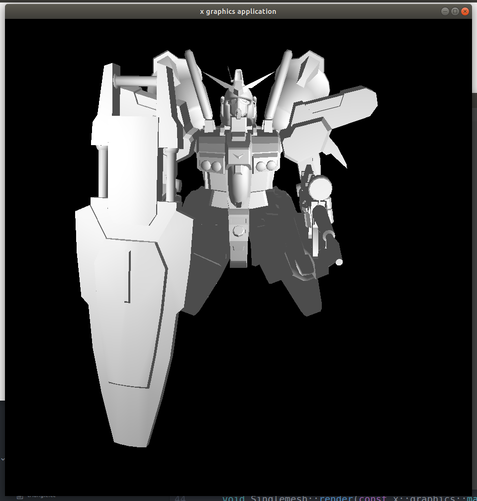
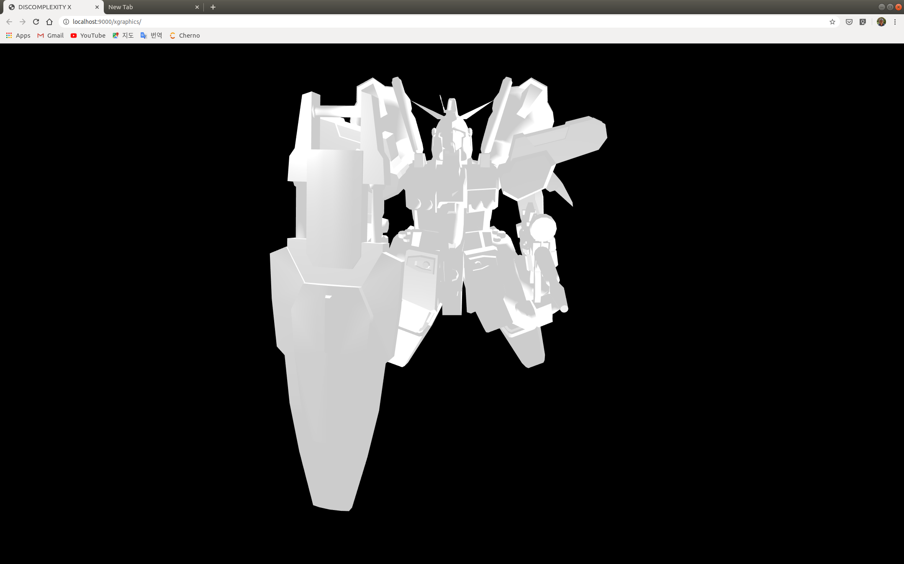

SIMPLE TRIANGLE DRAWING
=======================

간단한 삼각형을 그리기 위해서 저는 몇줄의 코드를 짰던 것일까요?
이제 큐브를 그리고 그리고 이제 다시 홈월드 객체를 그리면 됩니다.
그러고 나면 자바스크립트 웹 렌더링 관련 로직을 짜고
그러면 텍스쳐 매핑으로 움직이겠지요.

SIMPLE CUBE DRAWING
===================

칼라 큐브도 그렸습니다.
기하학적인 기초 도형에 대한 것 중에서 원과 사각형 그리고 구 뭐 이런 것들도 해나갈 것입니다.
필요하면 그 때 그때
복잡하게 왔다갔다 하지만,
지금의 프로그램 파라미터 처리를 나뻐하지 않습니다.
다만, 쉐이더를 직접 읽어서 그것에 필요한 파라미터를 직접 추출하고 그것을 자동으로 만들어 주면 설정해주면 좋을 것 같지만,
현재는 현재의 것에 만족합니다.

HOMEWOLRD2 OBJECT DESERIALIZE
=============================

이제 메인 함수를 짭니다.

```c++
int main(int argc, char ** argv)
{
    return 0;
}
```

항상 일은 뒤로 미루어 두면 하나씩 하나씩 나타납니다.
모든 것을 계획적으로 짤 수 있을까요?
그래야 할 이유도 그렇지 말아야 할 이유도 없습니다.
뭔가 생각할 꺼리가 있다는 것이 프로그래밍의 즐거움 아닐까요?

정적 메서드들로 파일 입력 스트림 객체를 오픈 하는 것의 이름을 어떻게 지어야 할까요?
다행히 이전에 만들어 두었던 것의 내부 인터페이스가 크게 변경되지 않아서 이전에 작성해 두었던 것을
힘들이지 않고 바로 적용할 수 있게 되었습니다.



JAVASCRIPT X GRAPHICS
=====================

리팩터링을 하면서 간단하게 로딩을 구현하로 합니다.
파일이 크고 보정이 이루어져야 하는데, 그것을 하기 위해서 시간이 걸리는 작업이 있습니다.
이 부분에 대해서 저는 웹 워커를 이용했는데
가만히 움직이지 않으니까 아무것도 안그려지는 버그가 있어 보입니다.
그래서 간단한 삼각형을 구현하고 나면
로딩과 관련된 부분을 구현하여 이전에 불편했던 점을 해소하려 합니다.
이저 버전 0.0.1 의 태그를 달 수 있어 보이네요.

그 이전에 이번에 작업을 하면서 버텍스와 버퍼에 대한 정보만을 가지고 있는 객체와 참조란 개념을 두었습니다.
객체는 버텍스 정보와 버퍼를 가지고 있어서, 외부 파라미터에 의해서 복제가 될 수 있습니다.
참조는 객체를 포인터 형식으로 가지고 있고, 무겁지 않은 위치, 회전, 크기 등의 정보를 가지고 있습니다.
그래서 같은 종류의 객체들의 다른 특성을 가질 수 있도록 하였습니다.

JAVASCRIPT 에서 Object 를 이름으로 사용할 수 없어 보입니다.
뭔가 객체를 뜻하는 괜찮은 말이 없을까요?
구관이 명관입니다. 달리 이름을 붙이진는 않으려 합니다.
그전 이전처럼 Obj
저는 클래스나 타입의 이름 함수의 이름들을 지을 때 짧은 단문을 좋아합니다.
언더바나 대문자가 들어가는 것에 대해서 비선호하지요
이건 지극하게 개인적인 취향입니다.
일단 자바스크립트는 웹팩으로 빌드까지만 할 수 있도록 하고
로딩을 구현하려 합니다.



LOADING
=======

아무것도 그려지지 않으니 멈춘 듯 하게 보입니다.
로딩을 WEBGL 로 구현해야겠군요.
로딩에는 다른 리소스가 필요없을 것 같습니다.

텍스트를 WEBGL 로 그리는 것을 고민해보고 있습니다.
아직은 테스트가 들어갈 것 같지는 않지만, 언젠가는 들어가야 하는 부분이겠지요.
순간 순간 그릴 수 있으면 좋겠지만 일단 어떻게 구현해야할지 고민이 됩니다.

로딩은 직사각형에 안에 색깔이 채워지는 것으로 구현하려 합니다.
일단, 직사각형이 필요하겠네요.

아직은 자바스크립트 쪽에 레퍼런스란 개념을 도입하지는 않을 것 입니다.

로딩을 일차적으로 구현하였습니다.
자바스크립트는 체계적으로 짜기 보다는 왠지 빨리 짜는 경향이 있네요.
아직은 조금 다듬어야 하는데, 로딩 서페이스를 두고
메인 서페이스를 로딩이 끝나면 처리하는 방식을 고민하고 있습니다.
이제 자바스크립트도 조금 설계를 하고 진행해야 겠네요.

네이티브 쪽에 같은 개념을 도입하려 합니다.
