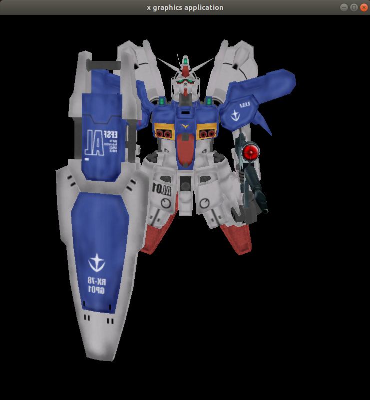
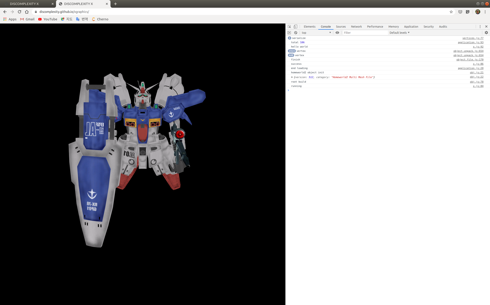

TEXTURE MAPPING
===============

드디어 텍스쳐 매핑이 그려졌습니다. 밉맵을 위해서 1 x 1 까지 그려야 하는 군요.
그래서 저는

```
glGenerateMipmap(GL_TEXTURE_2D);
```

으로 만들어지지 않은 밉맵을 생성하도록 하였습니다.
그렇지 않으면 다 생성되지 않아서 검은색으로 그려지더라구요.



WEBGL TEXTURE
=============

어쩔 수 없이 웹지엘 확장을 사용했습니다.
체크를 해야겠네요.



- [ ] WEBGL EXTENSION 체크하기

NEXT MILESTONES
===============

일단 홈월드2 모드 중에서 건담 모드의 객체 하나에 대해서 텍스쳐 매핑까지 구현하는 것을 목적으로 한 것을 달상했습니다. 살짝 피곤함이 밀려 오네요. 아이필드 같이 레이져 빔에 방어막 같은 것도 넣어 보는 상상을 해봅니다. 일단, 구조는 하나의 리소스 파일을 참조하여 여러 개를 표현할 수 있도록 구조는 잡아 두었는데, 테스트를 해봐야 겠네요. 카메라 Z 위치가 90 인데, 1000 정도로 테스트 해볼까 합니다. 300 정도로 조정했습니다.

역시 광원을 적용해야겠군요.
백그라운드가 검은 색이니까 왠지 그냥 테스트 페이지 같군요.
맵을 만들어 봐야겠네요.
엔진에서 뭔가 밝은 빛이 나가야 겠군요.
자체적으로 내뿜는 빛이라 좋아 보입니다.
엔진 버닝 쉐이더 뭐 이런 것을 고민해야 겠습니다.
그외에 여러 다른 홈월드2 객체를 로딩해서 쓸 수 있도록 해야겠네요.
웹에서 홈월드2 파일을 디시리얼라이즈할 수 있도록 해야 겠구요.
할 것들이 많네요.
홈월드2 스펙도 정리해야겠습니다.
아차차차 총알도 레이져도 나갈 수 있도록 해야겠군요.
키보드와 마우스 이벤트도 정리해야겠네요.

FREEGLUT 를 이제 제거해야할 시점이 된 것 같기도 하네요.
그리고 이제까지 개발된 것도 UML 로 정리해야겠구요.
UML 로 정리하다보면 리팩터링의 유혹이 밀려옵니다.
그것을 참아야겠구요.

사람들이 쉽게 프로그래밍을 할 수 있는 라이브러리화도 목적으로 하고 있는데,
오늘 구현에서 PRIMITIVE 를 구현하는데, 복잡하게 구현하도록 짠 것 같은 느낌이 들더라구요. 이를 쉽게 만들 수 있도록 해야할 듯 보이구요.

게임 월드란 개념도 이제 고민해야 할 시점인 듯 보입니다.
현재는 SURFACE 란 이름으로 이를 만들었는데, 적절한 이름을 고민해야겠군요.

간단한 물리 개념을 도입하는 것! 하하하! 속도와 가속 뭐 이런 것도 들어가려 하구요. 강체도 들어가야겠네요.
아이필드 꼭 넣구 싶습니다.
레이져 빔은 방어막처럼 타격만 주고 기체는 손상 시키지 않지요.
물리적 타격만 통하는 뭐 그런 것!
이제 구도 구현해 놓아야할 것 같네요.
콜리젼도 구현이 되어야 겠구요.
아하하하하 할 것이 많네요.
그렇지만 많이 왔네요.

엔진이 동작하는 모습과 광원에 대해서 조금 더 고민을 하면 좋은 그래픽이 그려지겠네요.

이런 것들과 함께 무엇을 하면 게임 처럼 동작하게 될까요?

무기 시스템을 구현해야겠지요.

무기의 그래픽을 구현하고 이것을 애니메이션 해야갰지요.
무기에는 물리적인 무기와 빔 무기로 고민하고 있습니다.
방어도 고민하고 있는데 빔 무기는 타격 애니메이션이 이뤄지도록 되겠지만, 실제 체력을 달지 않겠지요. (방어시스템이 있다면,)
다만, 빔 무기가 타격이 이루어지면 큰 타격 감을 주겠지만, 아이 필드가 있는 객체라면 체력은 달지 않을 겁니다.
물리적 총알이나 폭탄 같은 경우도 고민해야겠네요. 이것은 아이필드를 통과하지만, 물리적 데미지는 적을 것 같구요.
소프트 타겟과 하드 타겟의 고민을 하고 있습니다.
매터리얼 개념이 그래픽스에 들어가는 것이 아니라 다른 곳에 들어가면 좋을 것 같습니다.

그리고 현재는 객체가 움직이지 않는데, 사용자가 움직일 수 있도록 구현이 되어야 겠네요.

오늘 들어가면 홈월드2를 설치해야겠네요! 하하하하!
그리고 또! 팬저제너럴도 즐겨야겠네요. 분석하면서,...

다음 목표로 간단하게 객체는 이동을 하고 여러 객체가 있으며,
레이어 개념을 두어야겠네요.
백그라운드를 제공하려 합니다.
그래픽스 레퍼런스를 이제 조작할 수 있어야 할 듯 보입니다.
이것을 하려면 그래픽스 레퍼런스를 선택할 수 있어야 겠지요.
선택하면 선택되었음을 디스플레이 해야겠네요.
대략 어떻게 해야할지 생각하고 있는 것이 있어서, 일단 구와 원을 구현해야겠네요.
간단한 물리 객체를 만들어야 겠습니다.

내일은 간단한 아이콘 부터 만들어봐야겠습니다.
